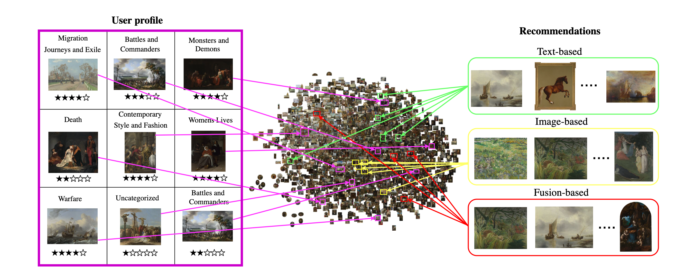
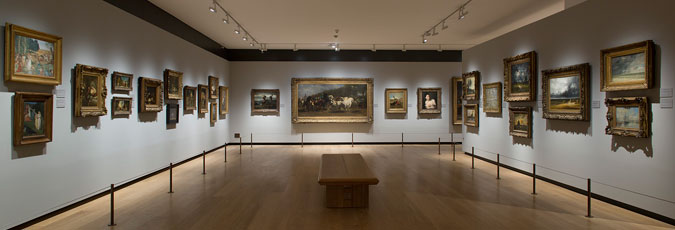

# VA_RecSys
<p align="center">
 
</p>

The official implementation of "The Elements of Visual Art Recommendation: Learning Latent Semantic Representations of Paintings" [Paper]() which will appear in the Proceedings of the ACM Conference on Human Factors in Computing Systems [(CHI 2023).](https://chi2023.acm.org/)


<p align="center">
 
</p>

## Setup 

See [flask instructions](flask/README.md) for setting up the services
and [app instructions](app/README.md) for setting up the web application.

Citation
========

When you use this work or method for your research, we ask you to cite the following publication:


[Bereket A. Yilma, Luis A. Leiva: The Elements of Visual Art Recommendation: Learning Latent Semantic Representations of Paintings, Proceedings of the ACM Conference on Human Factors in Computing Systems (CHI 2023)](#)

``` bibtex


```
