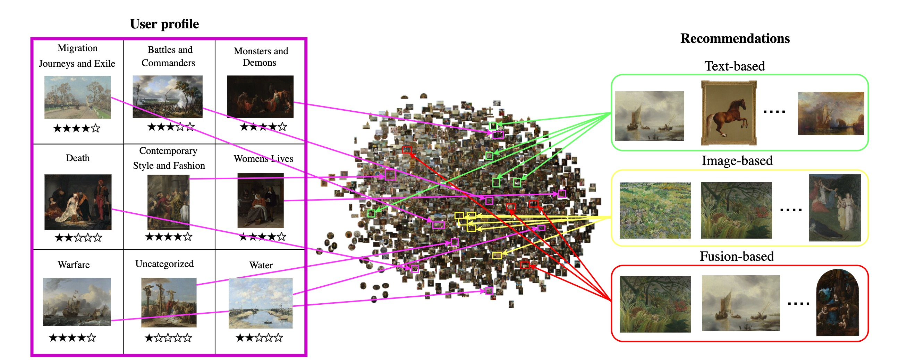

# VA_RecSys

<p align="center">
 
</p>

The official implementation of "The Elements of Visual Art Recommendation: Learning Latent Semantic Representations of Paintings" [Paper](https://dl.acm.org/doi/10.1145/3544548.3581477) which will appear in the Proceedings of the ACM Conference on Human Factors in Computing Systems [(CHI 2023).](https://chi2023.acm.org/)

<p align="center"></br>
 
</p>

## Setup 

See [flask instructions](flask/README.md) for setting up the services
and [app instructions](app/README.md) for setting up the web application.

Citation
========

When you use this work or method for your research, we ask you to cite the following publication:


[Bereket A. Yilma, Luis A. Leiva: The Elements of Visual Art Recommendation: Learning Latent Semantic Representations of Paintings, Proceedings of the ACM Conference on Human Factors in Computing Systems (CHI 2023)](https://dl.acm.org/doi/abs/10.1145/3544548.3581477)

``` bibtex
@inproceedings{10.1145/3544548.3581477,
author = {Yilma, Bereket A. and Leiva, Luis A.},
title = {The Elements of Visual Art Recommendation: Learning Latent Semantic Representations of Paintings},
year = {2023},
isbn = {9781450394215},
publisher = {Association for Computing Machinery},
address = {New York, NY, USA},
url = {https://doi.org/10.1145/3544548.3581477},
doi = {10.1145/3544548.3581477},
abstract = {Artwork recommendation is challenging because it requires understanding how users interact with highly subjective content, the complexity of the concepts embedded within the artwork, and the emotional and cognitive reflections they may trigger in users. In this paper, we focus on efficiently capturing the elements (i.e., latent semantic relationships) of visual art for personalized recommendation. We propose and study recommender systems based on textual and visual feature learning techniques, as well as their combinations. We then perform a small-scale and a large-scale user-centric evaluation of the quality of the recommendations. Our results indicate that textual features compare favourably with visual ones, whereas a fusion of both captures the most suitable hidden semantic relationships for artwork recommendation. Ultimately, this paper contributes to our understanding of how to deliver content that suitably matches the user’s interests and how they are perceived.},
booktitle = {Proceedings of the 2023 CHI Conference on Human Factors in Computing Systems},
articleno = {24},
numpages = {17},
keywords = {Personalization, Machine Learning, User Experience, Recommendation, Artwork},
location = {Hamburg, Germany},
series = {CHI '23}
}

```
