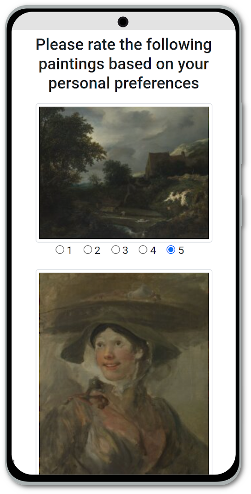
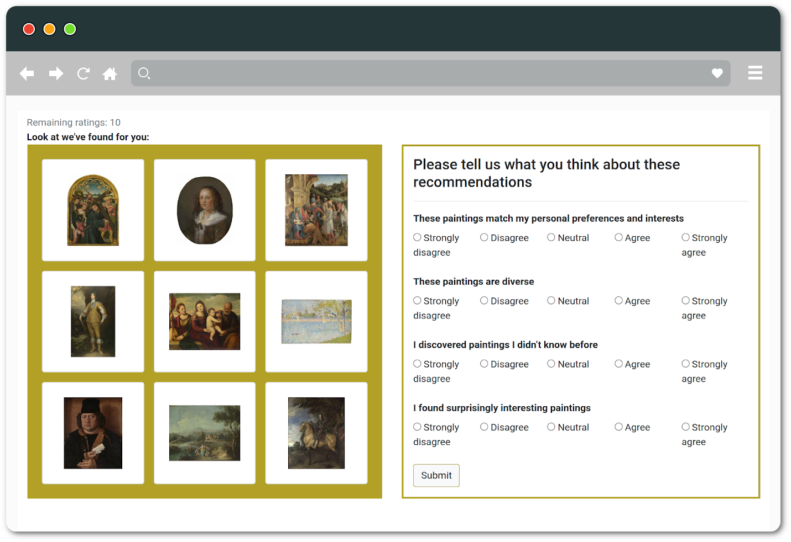

# Visual Art RecSys App
<p align="center">
 
</p>

This app will evaluate several recommender systems in real-time.
The user has to enter some preferences first and different RecSys engines will provide recommendations that the user must rate.

## Install

PHP with cURL support is required:
```sh
sudo apt-get install php php-curl
```

Download and unzip app data:
```sh
wget https://project-banana.eu/va-recsys/appdata.zip
unzip -q appdata.zip
```

## Running the app

You can launch a dev server for local testing:
```sh
php -S localhost:8080
```

Then open http://localhost:8080 in your browser.


**Note:** You should use a proper web server in production, such as [nginx](https://www.nginx.com/).
### -


<p align="center">
Elicitation screen in mobile mode</br>  </br> </br> Recommendation screen in laptop mode  
</p>

